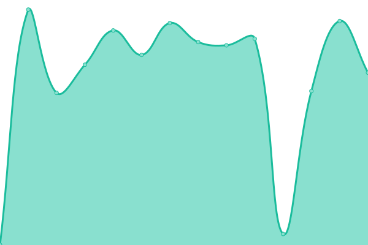

# [📈 Live Status](https://waallaby.github.io/up-time): <!--live status--> **🟩 All systems operational**

This repository contains the open-source uptime monitor and status page for [waallaby](https://waallaby.github.io/up-time), powered by [Upptime](https://github.com/upptime/upptime).

With [Upptime](https://upptime.js.org), you can get your own unlimited and free uptime monitor and status page, powered entirely by a GitHub repository. We use [Issues](https://github.com/waallaby/up-time/issues) as incident reports, [Actions](https://github.com/waallaby/up-time/actions) as uptime monitors, and [Pages](https://waallaby.github.io/up-time) for the status page.

<!--start: status pages-->
<!-- This summary is generated by Upptime (https://github.com/upptime/upptime) -->
<!-- Do not edit this manually, your changes will be overwritten -->
<!-- prettier-ignore -->
| URL | Status | History | Response Time | Uptime |
| --- | ------ | ------- | ------------- | ------ |
|  Requests | Waallaby-Net | 🟩 Up | [requests-waallaby-net.yml](https://github.com/waallaby/up-time/commits/HEAD/history/requests-waallaby-net.yml) | 

 1082ms
     
 | 

<a href="https://status.waallaby.net/history/requests-waallaby-net">99.34%</a>
    

|  Plex Server | Waallaby-Net | 🟩 Up | [plex-server-waallaby-net.yml](https://github.com/waallaby/up-time/commits/HEAD/history/plex-server-waallaby-net.yml) | 

 693ms
     
 | 

<a href="https://status.waallaby.net/history/plex-server-waallaby-net">99.51%</a>
    

|  DSM | Synology | 🟩 Up | [dsm-synology.yml](https://github.com/waallaby/up-time/commits/HEAD/history/dsm-synology.yml) | 

 764ms
     
 | 

<a href="https://status.waallaby.net/history/dsm-synology">99.51%</a>
    

|  Home Assistant | 🟩 Up | [home-assistant.yml](https://github.com/waallaby/up-time/commits/HEAD/history/home-assistant.yml) | 

 751ms
     
 | 

<a href="https://status.waallaby.net/history/home-assistant">99.71%</a>
    

|  Sonarr | 🟩 Up | [sonarr.yml](https://github.com/waallaby/up-time/commits/HEAD/history/sonarr.yml) | 

 924ms
     
 | 

<a href="https://status.waallaby.net/history/sonarr">99.34%</a>
    

|  Radarr | 🟩 Up | [radarr.yml](https://github.com/waallaby/up-time/commits/HEAD/history/radarr.yml) | 

 956ms
     
 | 

<a href="https://status.waallaby.net/history/radarr">99.34%</a>
    

|  Prowlarr | 🟩 Up | [prowlarr.yml](https://github.com/waallaby/up-time/commits/HEAD/history/prowlarr.yml) | 

 944ms
     
 | 

<a href="https://status.waallaby.net/history/prowlarr">99.34%</a>
    

|  qBit | 🟩 Up | [q-bit.yml](https://github.com/waallaby/up-time/commits/HEAD/history/q-bit.yml) | 

 738ms
     
 | 

<a href="https://status.waallaby.net/history/q-bit">99.71%</a>
    

<!--end: status pages-->

[**Visit our status website →**](https://waallaby.github.io/up-time)

## 📄 License

- Powered by: [Upptime](https://github.com/upptime/upptime)
- Code: [MIT](./LICENSE) © [waallaby](https://waallaby.github.io/up-time)
- Data in the `./history` directory: [Open Database License](https://opendatacommons.org/licenses/odbl/1-0/)
