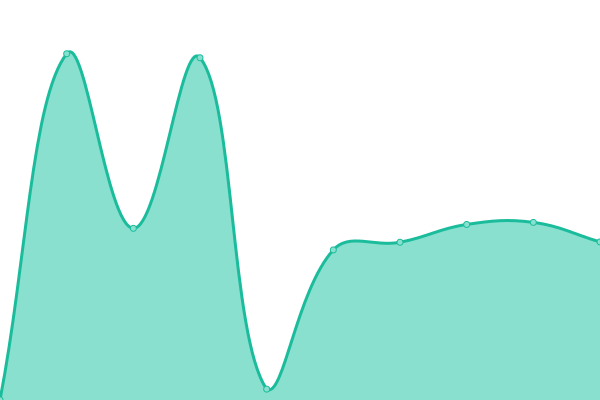

# [📈 Live Status](https://waallaby.github.io/up-time): <!--live status--> **🟥 Complete outage**

This repository contains the open-source uptime monitor and status page for [waallaby](https://waallaby.github.io/up-time), powered by [Upptime](https://github.com/upptime/upptime).

With [Upptime](https://upptime.js.org), you can get your own unlimited and free uptime monitor and status page, powered entirely by a GitHub repository. We use [Issues](https://github.com/waallaby/up-time/issues) as incident reports, [Actions](https://github.com/waallaby/up-time/actions) as uptime monitors, and [Pages](https://waallaby.github.io/up-time) for the status page.

<!--start: status pages-->
<!-- This summary is generated by Upptime (https://github.com/upptime/upptime) -->
<!-- Do not edit this manually, your changes will be overwritten -->
<!-- prettier-ignore -->
| URL | Status | History | Response Time | Uptime |
| --- | ------ | ------- | ------------- | ------ |
|  [Waallaby-Net Requests](https://request.waallaby.net/) | 🟥 Down | [waallaby-net-requests.yml](https://github.com/waallaby/up-time/commits/HEAD/history/waallaby-net-requests.yml) | 

 1276ms
     
 | 

<a href="https://status.waallaby.net/history/waallaby-net-requests">14.94%</a>
    

|  [Plex Server](https://plex.waallaby.net/identity) | 🟥 Down | [plex-server.yml](https://github.com/waallaby/up-time/commits/HEAD/history/plex-server.yml) | 

 718ms
     
 | 

<a href="https://status.waallaby.net/history/plex-server">17.66%</a>
    

|  [DSM](https://admin.waallaby.net) | 🟥 Down | [dsm.yml](https://github.com/waallaby/up-time/commits/HEAD/history/dsm.yml) | 

 969ms
     
 | 

<a href="https://status.waallaby.net/history/dsm">60.24%</a>
    

|  [Home Assistant](https://assistant.waallaby.net/) | 🟥 Down | [home-assistant.yml](https://github.com/waallaby/up-time/commits/HEAD/history/home-assistant.yml) | 

 794ms
     
 | 

<a href="https://status.waallaby.net/history/home-assistant">61.97%</a>
    

|  [Sonarr](https://tv.waallaby.net/) | 🟥 Down | [sonarr.yml](https://github.com/waallaby/up-time/commits/HEAD/history/sonarr.yml) | 

 1405ms
     
 | 

<a href="https://status.waallaby.net/history/sonarr">61.06%</a>
    

|  [Radarr](https://movies.waallaby.net/) | 🟥 Down | [radarr.yml](https://github.com/waallaby/up-time/commits/HEAD/history/radarr.yml) | 

 2275ms
     
 | 

<a href="https://status.waallaby.net/history/radarr">61.18%</a>
    

|  [Prowlarr](https://index.waallaby.net/) | 🟥 Down | [prowlarr.yml](https://github.com/waallaby/up-time/commits/HEAD/history/prowlarr.yml) | 

 1511ms
     
 | 

<a href="https://status.waallaby.net/history/prowlarr">61.24%</a>
    

|  [qBit](https://torrent.waallaby.net/) | 🟥 Down | [q-bit.yml](https://github.com/waallaby/up-time/commits/HEAD/history/q-bit.yml) | 

 1892ms
     
 | 

<a href="https://status.waallaby.net/history/q-bit">20.09%</a>
    

<!--end: status pages-->

[**Visit our status website →**](https://waallaby.github.io/up-time)

## 📄 License

- Powered by: [Upptime](https://github.com/upptime/upptime)
- Code: [MIT](./LICENSE) © [waallaby](https://waallaby.github.io/up-time)
- Data in the `./history` directory: [Open Database License](https://opendatacommons.org/licenses/odbl/1-0/)
